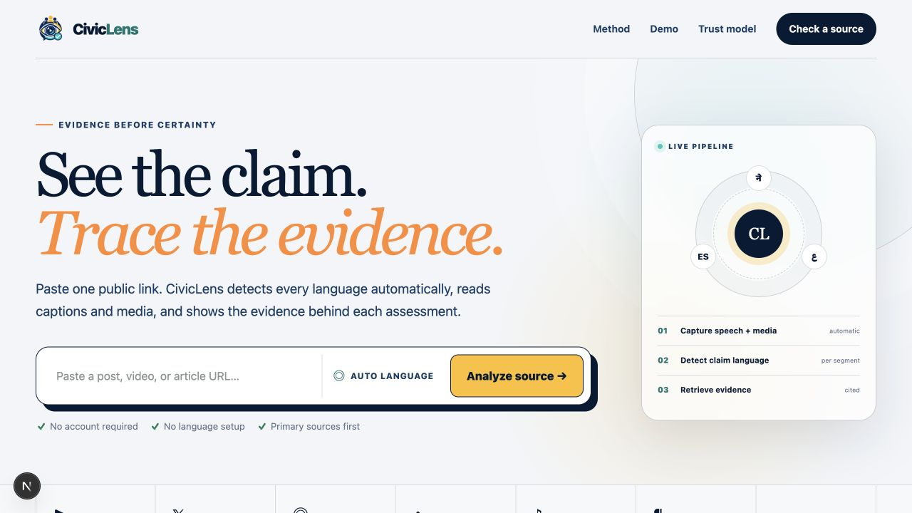
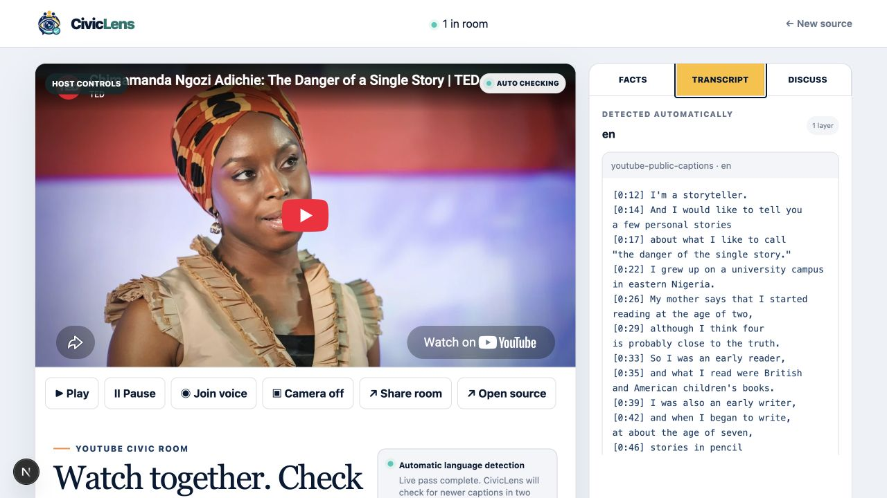

<p align="center">
  
</p>

# CivicLens

**Watch together. Verify with evidence.**

CivicLens is an automatic-language, evidence-first fact-checking application for public YouTube videos and live streams, individual X, Instagram, Reddit, and TikTok posts, articles, and other public webpages. There is no language selector or allowlist: language is detected per transcript segment and claim, original wording is preserved, and retrieval expands into the source language, relevant official languages, and English.

## Demo

The screenshots below were captured from the working local application. They show the landing page, the persistent room created for the requested live stream, and a captions-enabled room with automatically detected English transcript timestamps.

| Automatic-language entry | Successful caption extraction |
| --- | --- |
|  |  |

### Requested live-stream test

Tested with [`youtube.com/live/Nq2wYlWFucg`](https://www.youtube.com/live/Nq2wYlWFucg?si=wruh8wl25mE3J4u_). CivicLens normalized it to `youtube:Nq2wYlWFucg`, created/reused the same database room, joined LiveKit with camera off, and started the automatic analysis pass.


This source does not expose reusable public captions, and embed availability has varied by YouTube client. CivicLens keeps an **Open source** action and reports incomplete source-caption coverage instead of fabricating text. The LiveKit fallback was also verified with this URL: sharing the YouTube browser tab with **Share tab audio** produced interim and final room transcripts, automatically detecting English and Hindi during code-switched speech. A second public YouTube source with captions separately verified 357 timestamped segments and automatic `en` detection.

## Implemented product

- One URL entry point and canonical IDs for YouTube, X, Instagram, Reddit, TikTok, articles, and generic public pages.
- Persistent civic rooms for every supported public URL: the same canonical YouTube, article, or public social link resolves to the same room. YouTube has embedded playback controls; other sources can be opened in a tab and shared with audio/video.
- Host-controlled shared YouTube play/pause, anonymous LiveKit presence, voice, chat, moderation, opt-in camera, and browser-tab video/audio sharing. Camera is off on every join.
- A single named LiveKit worker per room transcribes only the host's explicitly shared tab audio (never meeting microphones). Final segments are retained in the room transcript history, streamed to every participant, and included in the host-led background verification refresh.
- Public HTML is fetched server-side with SSRF and size protections, parsed by Readability, and falls back to a browser-capable reader only when a publisher blocks direct cloud access.
- Xpoz ingestion for X, Instagram, Reddit, and TikTok, with managed-extractor and paste/upload fallbacks.
- SSRF-safe fetching, safe redirects, MIME and size limits, article Readability extraction, one-level linked-page extraction, and visible coverage manifests.
- Multilingual structured claim extraction and evidence-constrained assessment through OpenRouter.
- Tavily, Google Fact Check, and official-source registries for Nepal, India, the US, the UK, and global institutions.
- Evidence strength, primary-source availability, citations, selection provenance, and explicit limitations—never a misleading “truth percentage.”
- Server-rendered landing and analysis pages with small client islands only where polling, media, and realtime interaction require them.
- PostgreSQL/Drizzle persistence for versioned runs, artifacts, transcripts, claims, evidence, fact checks, rooms, participants, and messages.
- Fixture-backed development mode for work before provider keys are configured.

## Local setup

```bash
cp .env.example .env
npm install
npm run db:migrate
npm run dev
```

`npm run dev` starts both Next.js and the named LiveKit transcription worker. Open [http://localhost:3000](http://localhost:3000), enter a YouTube URL, then select **Share video + audio**. Choose the YouTube browser tab and keep **Share tab audio** enabled. CivicLens dispatches the worker as soon as someone joins the room; its transcript is broadcast to every room participant and opens their Transcript tab as captions arrive. No language selection is required.

Leave `FIXTURE_MODE=true` for a clearly labeled provider-free fact-check UI demo. Set it to `false` to use live extraction, models, and evidence retrieval. Live room transcription uses LiveKit Cloud Inference and only requires the three LiveKit credentials.

Run the release checks:

```bash
npm run verify
```

## Environment and key security

Copy `.env.example`; do not commit `.env`. Every credential is read only by server modules and route handlers. No provider credential uses a `NEXT_PUBLIC_` prefix, and LiveKit clients receive short-lived room tokens rather than API secrets.

Required for a full production deployment:

| Variable | Purpose |
| --- | --- |
| `DATABASE_URL` | Pooled PostgreSQL URL for Vercel/serverless runtime requests |
| `DATABASE_URL_UNPOOLED` | Direct PostgreSQL URL used by Drizzle migrations |
| `APP_URL` | Canonical deployed origin, for example `https://civiclens.example` |
| `HOST_TOKEN_SECRET` | Random value of at least 32 characters for host capabilities |
| `OPENROUTER_API_KEY` | Claim extraction, vision, and evidence assessment |
| `TAVILY_API_KEY` | Official-domain and broader-web evidence search |
| `XPOZ_API_KEY` | X, Instagram, Reddit, and TikTok ingestion/search |
| `LIVEKIT_URL`, `LIVEKIT_API_KEY`, `LIVEKIT_API_SECRET` | Presence, voice/video sharing, playback data, and the server transcription worker |
| `BLOB_READ_WRITE_TOKEN` | Temporary fallback uploads |

Recommended by feature:

- `GOOGLE_FACT_CHECK_API_KEY` adds prior professional fact-check reviews.
- Live room audio is transcribed through LiveKit Cloud Inference. Uploaded audio/video requires the configurable managed media extractor and is otherwise marked partial.
- `MANAGED_EXTRACTOR_URL` and `MANAGED_EXTRACTOR_API_KEY` add compliant dynamic-page, platform-media, frame, and caption fallback coverage.
- `TRIGGER_WEBHOOK_URL` and `TRIGGER_SECRET_KEY` move long analyses to a managed worker.
- `SENTRY_DSN` enables production error reporting.

The verified OpenRouter defaults are `google/gemini-3.7-flash` and `google/gemini-3.1-pro-preview`. CivicLens also maps the original `google/gemini-*-latest` values to these current concrete IDs for backward compatibility. Generated output is validated with Zod on the server before it enters the evidence pipeline.

## Vercel deployment

1. Create a PostgreSQL database and copy its pooled URL to `DATABASE_URL` and direct URL to `DATABASE_URL_UNPOOLED`.
2. Add the variables from `.env.example` to the Vercel project. Set `FIXTURE_MODE=false` and set `APP_URL` to the final production domain.
3. Apply the checked-in migration from a trusted machine or CI environment:

   ```bash
   npm run db:migrate
   ```

   PostgreSQL may print notices that the `drizzle` schema or `__drizzle_migrations` table already exists. Those notices are expected on repeat runs; the command now finishes with an explicit success line when all migrations are applied.

4. Push the repository to GitHub. The checked-in `Verify` workflow runs TypeScript, lint, tests, and the production build on pull requests and `main`.
5. Import the repository into Vercel. The checked-in `vercel.json` uses Node 24, `npm ci`, Fluid Compute, and a production build that fails early when required server environment variables are missing.
6. Deploy the persistent transcriber separately to LiveKit Cloud from the repository root. Set `LIVEKIT_TRANSCRIBER_NAME=civiclens-transcriber` in both the Vercel project and the LiveKit worker deployment (or use the same custom name in both):

   ```bash
   lk cloud auth
   lk agent create
   ```

   The checked-in `Dockerfile` runs `npm run agent:start`. The LiveKit CLI creates `livekit.toml` with the project and agent IDs; commit that generated non-secret configuration before later `lk agent deploy` runs.

7. Vercel hosts the Next.js application while LiveKit Cloud keeps the transcription worker connected and available for room jobs.
8. For reliable long video runs, configure `TRIGGER_WEBHOOK_URL`; the signed job endpoint is `POST /api/jobs/analysis` with `Authorization: Bearer $TRIGGER_SECRET_KEY`.
9. Run one production smoke test per configured provider. Verify the result page shows original claims, localized assessments, citations, extraction coverage, provenance, and limitations.

Do not run database migrations automatically in every serverless function build. Keep the direct database URL restricted to deployment/CI and use the pooled URL at runtime.

## Source behavior and fallbacks

“Any site” means best-effort extraction from any public HTTP/HTTPS URL. Dedicated behavior is guaranteed only for direct supported post URLs, YouTube video/live URLs, and article-like pages. Profile/feed URLs, private or login-only content, deleted sources, robots restrictions, and paywall bypass are excluded.

YouTube public captions are best-effort. The official YouTube caption-download API requires authorization to edit the video, so arbitrary public videos use the managed extractor when configured and a public-caption adapter otherwise. If captions are disabled, the UI requests an upload/paste fallback and marks coverage partial.

Safety limits are 100,000 extracted characters, 12 images, 30 minutes or 250 MB for non-YouTube media, and 60 keyframes. Larger or inaccessible inputs are marked partial instead of complete.

## API surface

```text
POST /api/sources/resolve
POST /api/analyses
GET  /api/analyses/:id
POST /api/uploads/presign
POST /api/claims
POST /api/livekit/token
GET|POST /api/rooms/transcript
GET /api/rooms/analysis
POST /api/rooms/:id/moderation
POST /api/jobs/analysis
```

`POST /api/analyses` returns `202`, an analysis ID, a shareable result URL, and the destination. YouTube destinations are canonical room URLs; other sources open the server-rendered shareable analysis page. Successful runs younger than 24 hours are reused unless `refresh: true` is requested.

## Trust boundaries

- Only public HTTP/HTTPS inputs are accepted. Localhost, private/link-local addresses, unsafe redirects, oversized downloads, and unsupported MIME types are blocked.
- Page, transcript, image, and social content is always untrusted data and cannot control tools or retrieval.
- CivicLens never bypasses authentication, privacy controls, robots restrictions, or paywalls.
- `SUPPORTED`, `CONTRADICTED`, and `MISLEADING` require selected evidence. Otherwise the result is `UNVERIFIED` or `INSUFFICIENT_EVIDENCE`.
- Missing provider access remains visible in the coverage manifest and limitations.
- Temporary copied media carries a 24-hour deletion deadline in persistence; production storage should enforce the matching lifecycle rule.
